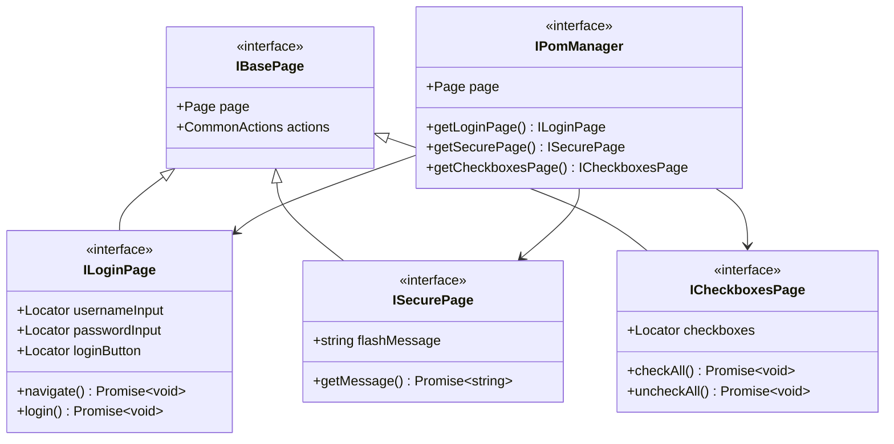
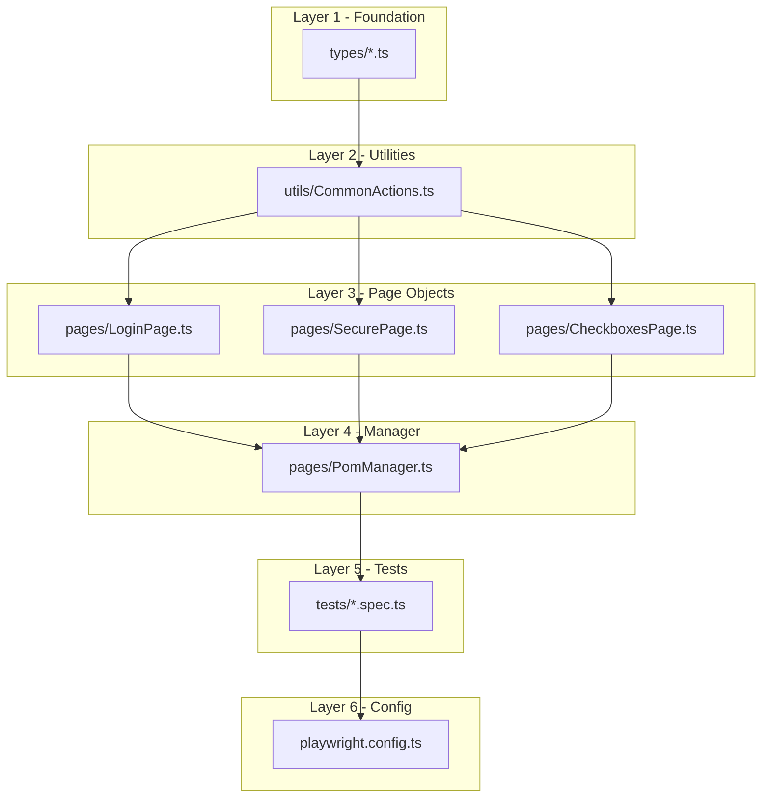

# TypeScript Migration Architecture Plan

## Executive Summary

This document outlines the comprehensive architecture plan for migrating the Playwright testing framework from JavaScript (ES modules) to TypeScript. The migration aims to improve type safety, code maintainability, IDE support, and scalability as the test suite grows to 100s-1000s of tests.

**Current State:** JavaScript ES modules with JSDoc type hints
**Target State:** Full TypeScript with strict type checking

---

## Table of Contents

1. [Migration Strategy](#1-migration-strategy)
2. [TypeScript Configuration](#2-typescript-configuration)
3. [Type Architecture](#3-type-architecture)
4. [Directory Structure](#4-directory-structure)
5. [File Conversion Order](#5-file-conversion-order)
6. [Package Dependencies](#6-package-dependencies)
7. [Risk Mitigation](#7-risk-mitigation)
8. [Implementation Phases](#8-implementation-phases)

---

## 1. Migration Strategy

### Recommended Approach: **Incremental Migration**

**Justification:**

| Factor | All-at-Once | Incremental ✓ |
|--------|-------------|---------------|
| Risk Level | High - all tests broken simultaneously | Low - gradual, controlled changes |
| Testability | Can only verify after complete migration | Verify after each file conversion |
| Rollback | Difficult - requires full revert | Easy - revert single file |
| Learning Curve | Steep - fix all issues at once | Gradual - learn patterns as you go |
| CI/CD Impact | Extended downtime | Continuous operation |

**Why Incremental Works for This Project:**
- The codebase has ~11 test files and 4 page objects - manageable scope
- Clear dependency hierarchy enables systematic conversion
- Playwright's `testMatch` already supports both `.js` and `.ts` files
- TypeScript can import from JavaScript seamlessly during transition

### Migration Phases Overview

```mermaid
graph LR
    A[Phase 1: Foundation] --> B[Phase 2: Types]
    B --> C[Phase 3: CommonActions]
    C --> D[Phase 4: Page Objects]
    D --> E[Phase 5: PomManager]
    E --> F[Phase 6: Tests]
    F --> G[Phase 7: Config]
    G --> H[Phase 8: Validation]
    
    style A fill:#e1f5fe
    style B fill:#e1f5fe
    style C fill:#fff3e0
    style D fill:#fff3e0
    style E fill:#fff3e0
    style F fill:#e8f5e9
    style G fill:#e8f5e9
    style H fill:#f3e5f5
```



---

## 2. TypeScript Configuration

### Recommended `tsconfig.json`

```json
{
  "compilerOptions": {
    // Target and Module Settings
    "target": "ES2022",
    "module": "ESNext",
    "moduleResolution": "bundler",
    "esModuleInterop": true,
    "allowSyntheticDefaultImports": true,
    
    // Strict Type Checking (Production Grade)
    "strict": true,
    "noImplicitAny": true,
    "strictNullChecks": true,
    "strictFunctionTypes": true,
    "strictBindCallApply": true,
    "strictPropertyInitialization": true,
    "noImplicitThis": true,
    "useUnknownInCatchVariables": true,
    "alwaysStrict": true,
    
    // Additional Checks for Large Codebases
    "noUnusedLocals": true,
    "noUnusedParameters": true,
    "exactOptionalPropertyTypes": true,
    "noImplicitReturns": true,
    "noFallthroughCasesInSwitch": true,
    "noUncheckedIndexedAccess": true,
    "noImplicitOverride": true,
    "noPropertyAccessFromIndexSignature": true,
    
    // Path Aliases for Clean Imports
    "baseUrl": ".",
    "paths": {
      "@pages/*": ["pages/*"],
      "@utils/*": ["utils/*"],
      "@types/*": ["types/*"],
      "@tests/*": ["tests/*"]
    },
    
    // Output and Source Settings
    "outDir": "./dist",
    "rootDir": ".",
    "declaration": true,
    "declarationMap": true,
    "sourceMap": true,
    
    // Interop Settings
    "resolveJsonModule": true,
    "isolatedModules": true,
    "verbatimModuleSyntax": false,
    
    // Skip lib check for faster builds
    "skipLibCheck": true,
    
    // Include type definitions
    "types": ["node"]
  },
  "include": [
    "pages/**/*.ts",
    "tests/**/*.ts",
    "utils/**/*.ts",
    "types/**/*.ts",
    "playwright.config.ts"
  ],
  "exclude": [
    "node_modules",
    "dist",
    "allure-results",
    "allure-report",
    "playwright-report",
    "test-results"
  ]
}
```

### Configuration Rationale

| Setting | Value | Reason |
|---------|-------|--------|
| `target: ES2022` | Latest stable ES features | Node.js 24+ support, async/await native |
| `module: ESNext` | ES modules | Matches existing `"type": "module"` in package.json |
| `moduleResolution: bundler` | Modern resolution | Best for modern tooling, handles .ts extensions |
| `strict: true` | Enable all strict checks | Essential for large codebases |
| `noUncheckedIndexedAccess` | Safer array access | Prevents undefined access bugs |
| `paths` aliases | Clean imports | `@pages/LoginPage` instead of `../pages/LoginPage` |

---

## 3. Type Architecture

### 3.1 Core Type Definitions Structure

```
types/
├── index.ts              # Re-exports all types
├── actions.types.ts      # CommonActions method options
├── pages.types.ts        # Page object interfaces
├── fixtures.types.ts     # Test fixture types
└── config.types.ts       # Configuration types
```

### 3.2 CommonActions Types (`types/actions.types.ts`)

```typescript
import type { Page, Locator } from '@playwright/test';

// Flexible selector type - accepts string or Locator
export type SelectorOrLocator = string | Locator;

// Wait states matching Playwright's WaitForState
export type WaitState = 'attached' | 'detached' | 'visible' | 'hidden';

// Load states matching Playwright's LoadState
export type LoadState = 'load' | 'domcontentloaded' | 'networkidle';

// Navigation options
export interface NavigateOptions {
  waitUntil?: 'load' | 'domcontentloaded' | 'networkidle' | 'commit';
  timeout?: number;
}

// Click action options
export interface ClickOptions {
  force?: boolean;
  timeout?: number;
}

// Fill action options
export interface FillOptions {
  timeout?: number;
}

// Type action options (sequential typing)
export interface TypeOptions {
  delay?: number;
  timeout?: number;
}

// Select option action options
export interface SelectOptions {
  timeout?: number;
}

// Check/Uncheck action options
export interface CheckOptions {
  timeout?: number;
}

// Get text options
export interface GetTextOptions {
  timeout?: number;
  trim?: boolean;
}

// Get attribute options
export interface GetAttributeOptions {
  timeout?: number;
}

// Visibility check options
export interface VisibilityOptions {
  timeout?: number;
}

// Wait options
export interface WaitOptions {
  state?: WaitState;
  timeout?: number;
}

// Wait for URL options
export interface WaitForUrlOptions {
  timeout?: number;
}
```

### 3.3 Page Object Types (`types/pages.types.ts`)

```typescript
import type { Page, Locator } from '@playwright/test';
import type CommonActions from '@utils/CommonActions';

// Base interface that all page objects must implement
export interface IBasePage {
  readonly page: Page;
  readonly actions: CommonActions;
}

// Login page specific interface
export interface ILoginPage extends IBasePage {
  readonly usernameInput: Locator;
  readonly passwordInput: Locator;
  readonly loginButton: Locator;
  readonly errorMessage: Locator;
  
  navigate(): Promise<void>;
  login(username: string, password: string): Promise<void>;
  getErrorMessage(): Promise<string | undefined>;
  assertErrorMessage(expectedMessage: string): Promise<void>;
  assertSuccessMessage(expectedMessage: string): Promise<void>;
}

// Secure page specific interface
export interface ISecurePage extends IBasePage {
  readonly flashMessage: string;
  
  getMessage(): Promise<string>;
  assertLoggedInMessage(passedMessage: string): Promise<void>;
}

// Checkboxes page specific interface
export interface ICheckboxesPage extends IBasePage {
  readonly checkboxesContainer: Locator;
  readonly checkboxes: Locator;
  
  checkCheckbox(index: number): Promise<void>;
  uncheckCheckbox(index: number): Promise<void>;
  checkAll(): Promise<void>;
  uncheckAll(): Promise<void>;
  getCheckboxStates(): Promise<boolean[]>;
  validateCheckboxState(index: number, expectedState: boolean): Promise<void>;
  validateAllCheckboxStates(expectedStates: boolean[]): Promise<void>;
  toggleCheckbox(index: number): Promise<void>;
  getCheckboxCount(): Promise<number>;
}

// Page constructor type for PomManager generics
export type PageConstructor<T extends IBasePage> = new (page: Page) => T;

// Union type of all page objects
export type AnyPageObject = ILoginPage | ISecurePage | ICheckboxesPage;
```

### 3.4 PomManager Types with Generics (`types/fixtures.types.ts`)

```typescript
import type { Page } from '@playwright/test';
import type { ILoginPage, ISecurePage, ICheckboxesPage } from './pages.types';

// PomManager interface with lazy-loading getters
export interface IPomManager {
  readonly page: Page;
  
  getLoginPage(): ILoginPage;
  getSecurePage(): ISecurePage;
  getCheckboxesPage(): ICheckboxesPage;
}

// Generic page getter type for extensibility
export type PageGetter<T> = () => T;

// Page registry for type-safe page retrieval
export interface PageRegistry {
  login: ILoginPage;
  secure: ISecurePage;
  checkboxes: ICheckboxesPage;
}

// Type-safe page name
export type PageName = keyof PageRegistry;
```

### 3.5 Type Hierarchy Diagram



---

## 4. Directory Structure

### Recommended Structure (Post-Migration)

```
playwright-project/
├── pages/                          # Page Object Model classes
│   ├── LoginPage.ts               # Login page object
│   ├── SecurePage.ts              # Secure area page object
│   ├── CheckboxesPage.ts          # Checkboxes page object
│   └── PomManager.ts              # Page object factory/manager
│
├── tests/                          # Test specification files
│   ├── pomTests.spec.ts           # POM-based tests
│   ├── assertions.spec.ts         # Assertion examples
│   ├── login.spec.ts              # Login tests
│   ├── selectors.spec.ts          # Selector tests
│   └── ...                        # Other test files
│
├── utils/                          # Utility functions
│   └── CommonActions.ts           # Common browser actions
│
├── types/                          # TypeScript type definitions
│   ├── index.ts                   # Barrel export
│   ├── actions.types.ts           # Action method types
│   ├── pages.types.ts             # Page object interfaces
│   └── fixtures.types.ts          # Test fixture types
│
├── playwright.config.ts            # Playwright configuration
├── tsconfig.json                   # TypeScript configuration
├── package.json                    # Dependencies and scripts
└── pnpm-lock.yaml                 # Lock file
```

### Key Structural Decisions

| Decision | Rationale |
|----------|-----------|
| Keep flat structure | Project is test-focused, not a library. No need for `src/` |
| Add `types/` folder | Centralizes type definitions, enables barrel exports |
| No `dist/` output needed | Playwright runs TypeScript directly via ts-node/esbuild |
| Keep original folders | Minimal disruption, maintains familiarity |

---

## 5. File Conversion Order

### Dependency Graph



### Optimal Conversion Order

| Order | File | Dependencies | Est. Effort |
|-------|------|--------------|-------------|
| 1 | `types/actions.types.ts` | None | 15 min |
| 2 | `types/pages.types.ts` | actions.types | 20 min |
| 3 | `types/fixtures.types.ts` | pages.types | 10 min |
| 4 | `types/index.ts` | All types | 5 min |
| 5 | `utils/CommonActions.ts` | types | 30 min |
| 6 | `pages/LoginPage.ts` | CommonActions, types | 20 min |
| 7 | `pages/SecurePage.ts` | CommonActions, types | 15 min |
| 8 | `pages/CheckboxesPage.ts` | CommonActions, types | 20 min |
| 9 | `pages/PomManager.ts` | All pages, types | 25 min |
| 10-20 | `tests/*.spec.ts` | PomManager | 10 min each |
| 21 | `playwright.config.ts` | None | 15 min |

**Total Estimated Time:** ~4-5 hours

---

## 6. Package Dependencies

### Required Additions

```json
{
  "devDependencies": {
    "typescript": "^5.7.2",
    "@types/node": "^24.10.1"
  }
}
```

### No Additional Packages Needed

- **Playwright** already includes TypeScript definitions (`@playwright/test` has built-in types)
- **ts-node** is NOT needed (Playwright uses esbuild internally)
- **Path alias resolution** handled by TypeScript + Playwright's built-in esbuild

### Updated `package.json` Scripts

```json
{
  "scripts": {
    "test": "pnpm exec playwright test",
    "test:smoke": "pnpm exec playwright test --grep \"@smoke\"",
    "test:regression": "pnpm exec playwright test --grep \"@regression\"",
    "test:ui": "pnpm exec playwright test --ui",
    "test:headed": "pnpm exec playwright test --headed",
    "test:debug": "pnpm exec playwright test --debug",
    "typecheck": "tsc --noEmit",
    "typecheck:watch": "tsc --noEmit --watch",
    "report": "pnpm exec playwright show-report",
    "allure:gen": "pnpm exec allure generate allure-results --clean -o allure-report",
    "allure:open": "pnpm exec allure open allure-report"
  }
}
```

---

## 7. Risk Mitigation

### 7.1 Potential Issues and Solutions

| Risk | Impact | Mitigation |
|------|--------|------------|
| **Import path changes** | Tests fail to find modules | Use path aliases (`@pages/`, `@utils/`) consistently |
| **Test file naming** | Playwright doesn't find tests | Config already supports `.spec.{js,ts}` |
| **Mixed JS/TS during migration** | Type conflicts | TypeScript can import JS; convert bottom-up |
| **Strict null checks** | Many `undefined` errors | Add null coalescing operators, fix gradually |
| **Optional property access** | Breaking existing code | Use optional chaining (`?.`) where needed |
| **CI/CD pipeline breaks** | Blocked deployments | Run typecheck in CI, but don't block on warnings initially |

### 7.2 Rollback Strategy

1. **Git branches**: Create feature branch `feature/typescript-migration`
2. **Incremental commits**: One commit per converted file
3. **Test after each conversion**: Run `pnpm test` after each file
4. **Revert single file**: `git checkout HEAD~1 -- <file>` if issues

### 7.3 Handling the Transition Period

During migration, both `.js` and `.ts` files will coexist:

```typescript
// In TypeScript files, import from JS files works:
import CommonActions from '../utils/CommonActions.js';  // Still .js during transition

// After migration, switch to:
import CommonActions from '@utils/CommonActions';  // Path alias, no extension needed
```

### 7.4 Known Type Challenges

**Challenge 1: Playwright's Locator Union Type**

```typescript
// Problem: Method accepts both string and Locator
async click(selectorOrLocator: string | Locator)

// Solution: Type guard function (already in CommonActions)
private _getLocator(selectorOrLocator: SelectorOrLocator): Locator {
  return typeof selectorOrLocator === 'string'
    ? this.page.locator(selectorOrLocator)
    : selectorOrLocator;
}
```

**Challenge 2: PomManager Lazy Loading**

```typescript
// Problem: Properties start as null
private _loginPage: LoginPage | null = null;

// Solution: Non-null assertion after check
getLoginPage(): LoginPage {
  if (!this._loginPage) {
    this._loginPage = new LoginPage(this.page);
  }
  return this._loginPage;  // TypeScript knows it's not null here
}
```

---

## 8. Implementation Phases

### Phase 1: Foundation (30 minutes)

**Tasks:**
1. Install TypeScript: `pnpm add -D typescript`
2. Create `tsconfig.json` with recommended settings
3. Create `types/` directory structure
4. Verify Playwright still runs existing JS tests

**Validation:**
```bash
pnpm exec tsc --version  # Verify TypeScript installed
pnpm test                 # Verify existing tests still work
```

### Phase 2: Type Definitions (45 minutes)

**Files to create:**
- `types/actions.types.ts`
- `types/pages.types.ts`
- `types/fixtures.types.ts`
- `types/index.ts`

**Validation:**
```bash
pnpm exec tsc --noEmit   # Should compile with no errors
```

### Phase 3: CommonActions Migration (30 minutes)

**Tasks:**
1. Rename `utils/CommonActions.js` → `utils/CommonActions.ts`
2. Add type annotations to all methods
3. Import types from `@types/actions.types`
4. Update page objects to import from `.ts`

**Validation:**
```bash
pnpm exec tsc --noEmit
pnpm test                 # All tests should pass
```

### Phase 4: Page Object Migration (1 hour)

**Conversion order:**
1. `pages/LoginPage.ts`
2. `pages/SecurePage.ts`
3. `pages/CheckboxesPage.ts`

**Per-file tasks:**
- Add interface implementation
- Type all method parameters and returns
- Type all class properties

### Phase 5: PomManager Enhancement (30 minutes)

**Tasks:**
1. Convert to TypeScript
2. Add proper generics for type-safe page retrieval
3. Implement `IPomManager` interface

### Phase 6: Test Migration (1.5 hours)

**Tasks:**
1. Rename each `.spec.js` to `.spec.ts`
2. Add type annotations to test fixtures
3. Fix any type errors from stricter checking

**Files (in order):**
1. `tests/pomTests.spec.ts` (most comprehensive, test first)
2. `tests/login.spec.ts`
3. `tests/assertions.spec.ts`
4. Remaining test files

### Phase 7: Config Migration (15 minutes)

**Tasks:**
1. Rename `playwright.config.js` → `playwright.config.ts`
2. Add `import type { PlaywrightTestConfig }` 
3. Type the configuration object

### Phase 8: Final Validation (30 minutes)

**Checklist:**
- [ ] `pnpm exec tsc --noEmit` passes with no errors
- [ ] `pnpm test` - all tests pass
- [ ] `pnpm test:headed` - visual verification
- [ ] Remove all `.js` files from `pages/`, `utils/`
- [ ] Update Memory Bank documentation
- [ ] Update README with TypeScript information

---

## Appendix A: Sample Converted Files

### A.1 CommonActions.ts (Key Methods)

```typescript
// utils/CommonActions.ts
import type { Page, Locator } from '@playwright/test';
import type {
  SelectorOrLocator,
  NavigateOptions,
  ClickOptions,
  FillOptions,
  GetTextOptions,
} from '@types/actions.types';

export default class CommonActions {
  constructor(private readonly page: Page) {}

  private _getLocator(selectorOrLocator: SelectorOrLocator): Locator {
    return typeof selectorOrLocator === 'string'
      ? this.page.locator(selectorOrLocator)
      : selectorOrLocator;
  }

  async navigate(url: string, options: NavigateOptions = {}): Promise<void> {
    const { waitUntil = 'domcontentloaded', timeout = 30_000 } = options;
    await this.page.goto(url, { waitUntil, timeout });
  }

  async click(
    selectorOrLocator: SelectorOrLocator,
    options: ClickOptions = {}
  ): Promise<void> {
    const { force = false, timeout = 10_000 } = options;
    const locator = this._getLocator(selectorOrLocator);
    await locator.waitFor({ state: 'visible', timeout });
    await locator.click({ force, timeout });
  }

  async getText(
    selectorOrLocator: SelectorOrLocator,
    options: GetTextOptions = {}
  ): Promise<string | undefined> {
    const { timeout = 10_000, trim = true } = options;
    const locator = this._getLocator(selectorOrLocator);
    await locator.waitFor({ state: 'visible', timeout });
    const text = await locator.textContent({ timeout });
    return trim ? text?.trim() : text ?? undefined;
  }
}
```

### A.2 LoginPage.ts

```typescript
// pages/LoginPage.ts
import { expect, type Page, type Locator } from '@playwright/test';
import CommonActions from '@utils/CommonActions';
import type { ILoginPage } from '@types/pages.types';

export default class LoginPage implements ILoginPage {
  public readonly page: Page;
  public readonly actions: CommonActions;
  public readonly usernameInput: Locator;
  public readonly passwordInput: Locator;
  public readonly loginButton: Locator;
  public readonly errorMessage: Locator;

  constructor(page: Page) {
    this.page = page;
    this.actions = new CommonActions(page);
    this.usernameInput = page.locator('#username');
    this.passwordInput = page.locator('#password');
    this.loginButton = page.locator('button[type="submit"]');
    this.errorMessage = page.locator('#flash');
  }

  async navigate(): Promise<void> {
    await this.actions.navigate('/login');
  }

  async login(username: string, password: string): Promise<void> {
    await this.actions.fill(this.usernameInput, username);
    await this.actions.fill(this.passwordInput, password);
    await this.actions.click(this.loginButton);
  }

  async getErrorMessage(): Promise<string | undefined> {
    return await this.actions.getText(this.errorMessage);
  }

  async assertErrorMessage(expectedMessage: string): Promise<void> {
    const actualMessage = await this.getErrorMessage();
    expect(actualMessage).toContain(expectedMessage);
  }

  async assertSuccessMessage(expectedMessage: string): Promise<void> {
    const actualMessage = await this.getErrorMessage();
    expect(actualMessage).toContain(expectedMessage);
  }
}
```

### A.3 PomManager.ts

```typescript
// pages/PomManager.ts
import type { Page } from '@playwright/test';
import LoginPage from './LoginPage';
import SecurePage from './SecurePage';
import CheckboxesPage from './CheckboxesPage';
import type { IPomManager } from '@types/fixtures.types';
import type { ILoginPage, ISecurePage, ICheckboxesPage } from '@types/pages.types';

export default class PomManager implements IPomManager {
  public readonly page: Page;
  private _loginPage: LoginPage | null = null;
  private _securePage: SecurePage | null = null;
  private _checkboxesPage: CheckboxesPage | null = null;

  constructor(page: Page) {
    this.page = page;
  }

  getLoginPage(): ILoginPage {
    if (!this._loginPage) {
      this._loginPage = new LoginPage(this.page);
    }
    return this._loginPage;
  }

  getSecurePage(): ISecurePage {
    if (!this._securePage) {
      this._securePage = new SecurePage(this.page);
    }
    return this._securePage;
  }

  getCheckboxesPage(): ICheckboxesPage {
    if (!this._checkboxesPage) {
      this._checkboxesPage = new CheckboxesPage(this.page);
    }
    return this._checkboxesPage;
  }
}
```

---

## Appendix B: Migration Checklist

### Pre-Migration
- [ ] Ensure all current tests pass
- [ ] Create git branch `feature/typescript-migration`
- [ ] Review this document with team

### During Migration
- [ ] Phase 1: TypeScript + tsconfig.json installed
- [ ] Phase 2: All type files created in `types/`
- [ ] Phase 3: CommonActions.ts converted and tested
- [ ] Phase 4: All page objects converted and tested
- [ ] Phase 5: PomManager converted with generics
- [ ] Phase 6: All test files converted
- [ ] Phase 7: playwright.config.ts converted
- [ ] Phase 8: Full test suite passes

### Post-Migration
- [ ] Delete all `.js` files from pages/, utils/
- [ ] Update Memory Bank context.md
- [ ] Update README.md with TypeScript setup
- [ ] Update brief.md to reflect TypeScript adoption
- [ ] Merge to main branch
- [ ] Update CI/CD to include typecheck step

---

## Document History

| Version | Date | Author | Changes |
|---------|------|--------|---------|
| 1.0 | 2025-11-29 | Kilo Code | Initial architecture plan |
